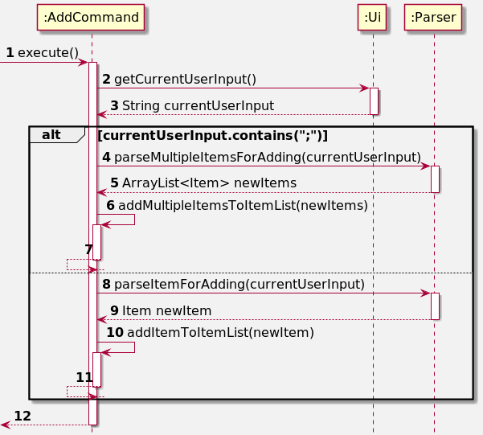

# Developer Guide

## Acknowledgements

{list here sources of all reused/adapted ideas, code, documentation, and third-party libraries -- include links to the original source as well}

## Design & implementation

### Adding Items Into Fridget

#### Main Objectives:

The functionality to add items is bound by two main objectives:
* Make adding items convenient for the user
* Parse enough information about the ingredient to benefit the user in the future

As a result, the current iteration requires two pieces of info from the user:
* The name of the ingredient
* The expiry date of the ingredient

This is done to minimize the input required from the user per entry, while maximising future uses with the data.

Future uses include:
* Finding if an ingredient exists by searching for its name
* Combining ingredients with similar names and expiry together
* Sort all ingredients by expiry date
* Remind users of expiring ingredients by name

#### Overall Sequence:

Step 1:

This step is almost always initiated by Fridget, but could potentially be done by another class in the future.

Step 2 & 3:

The parseIngredientForAdding() method is called in Parser, with the currentUserInput as a parameter.
The parser returns an Ingredient with the name and expiry date specified in the user input. 

Step 4:

If the user uses the '|' character in the ingredient's name, an exception is thrown.
This is done as the '|' may confuse the Storage class.

Step 5 & 6:

The Ingredient is added to IngredientList.
IngredientList returns a value signifying the current quantity of Ingredient in IngredientList.

Step 7 & 8:

If the Ingredient already exists in Fridget's IngredientList, print a message with the Ui to signify that the quantity of the existing item has increased to the user.

Step 9 & 10:

If the ingredient does not exist, print a message using Ui to signify to the user that a new Ingredient has been added into Fridget.

Step 11:

The execution of the execute() method ends.

## Product scope
### Target user profile

<b>Tech-savvy Families</b> who cook at home, buy groceries, and own a fridge

### Value proposition

Nowadays, fridges are operated manually. Hence, users need to go through item by item manually to perform any function related to their fridge, for example:
* Figuring out what food is close to expiring 
* Figuring out if they have enough ingredients for a certain recipe 
* Figuring out if they are any recipes that they can make with their ingredients 
* Adding/removing items into/from the fridge and storing it in a ledger
* Find out items that need to be bought soon

This CLI based application hopes to automate a lot of the tasks users have relating to the fridge, for example:
* Automated reminder for items nearing expiry or items requiring replenishment 
* Automated housekeeping: Storing items that are added/removed in a central ledger 
* Automated shopping list: Listing out missing ingredients for meals that users want to cook

## User Stories

|Version| As a ... | I want to ... | So that I can ...|
|--------|----------|---------------|------------------|
|v1.0|new user|see usage instructions|refer to them when I forget how to use the application|
|v2.0|user|find a to-do item by name|locate a to-do without having to go through the entire list|

## Non-Functional Requirements

{Give non-functional requirements}

## Glossary

* *glossary item* - Definition

## Instructions for manual testing

{Give instructions on how to do a manual product testing e.g., how to load sample data to be used for testing}
