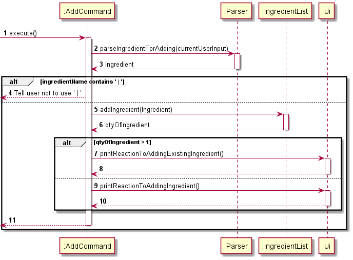
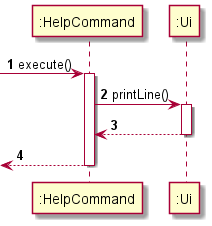
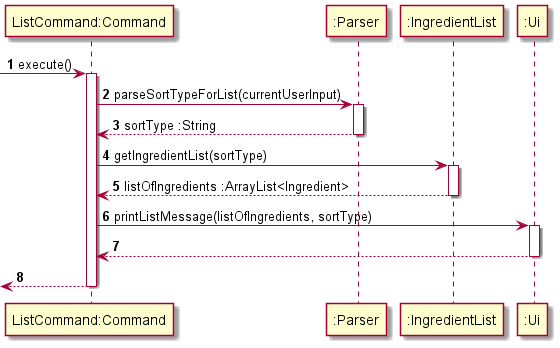

# Developer Guide

## Acknowledgements

* Inspired by [AddressBook-Level3 (AB3) DG](https://se-education.org/addressbook-level3/DeveloperGuide.html#architecture).
* Additional library used include [JANSI](https://github.com/fusesource/jansi).

## Setting Up Fridget
Refer to User Guide section on [Quick Start](https://ay2122s1-cs2113t-w12-4.github.io/tp/UserGuide.html#:~:text=be%20more%20efficient.-,Quick%20Start,-Ensure%20that%20you).

## Design & implementation

### Adding Items Into Fridget

#### Main Objectives:

The functionality to add items is bound by two main objectives:
* Make adding items convenient for the user
* Parse enough information about the ingredient to benefit the user in the future

As a result, the current iteration requires two pieces of info from the user:
* The name of the ingredient
* The expiry date of the ingredient

This is done to minimize the input required from the user per entry, while maximising future uses with the data.

Future uses include:
* Finding if an ingredient exists by searching for its name
* Combining ingredients with similar names and expiry together
* Sort all ingredients by expiry date
* Remind users of expiring ingredients by name

#### Overall Sequence:

Step 1:

This step is almost always initiated by Fridget, but could potentially be done by another class in the future.

Step 2 & 3:

The parseIngredientForAdding() method is called in Parser, with the currentUserInput as a parameter.
The parser returns an Ingredient with the name and expiry date specified in the user input. 

Step 4:

If the user uses the ' | ' character in the ingredient's name, an exception is thrown.
This is done as the ' | ' may confuse the Storage class.

Step 5 & 6:

The Ingredient is added to IngredientList.
IngredientList returns a value signifying the current quantity of Ingredient in IngredientList.

Step 7 & 8:

If the Ingredient already exists in Fridget's IngredientList, print a message with the Ui to signify that the quantity of the existing item has increased to the user.

Step 9 & 10:

If the ingredient does not exist, print a message using Ui to signify to the user that a new Ingredient has been added into Fridget.

Step 11:

The execution of the execute() method ends.

### Removing Items From Fridget

### Getting Help Manual 

#### Main Objectives:

The objective of a help manual in Fridget is to ensure users are equipped with the basic knowledge to get 
started with Fridget.

The idea behind an inbuilt help manual is to ensure Fridget is convenient and reduce the heavy reference of 
the User Guide.

Future uses include:
* More in-depth coverage of all basic functions.
* Interactive component to explore capabilities of each commands.

#### Sequence of execution:

Step 1: 

The execution of the Help Command is initiated by Fridget.

Step 2 & 3: 

The printLine() method is called in the Ui which prints out the String that is input into the method, 
in this case it is the help manual.

Step 4:

The execution of the execute() method ends.

### Resetting Item List In Fridget

#### Main Objectives:

The objective of the reset functionality is to provide users an easy way to remove all the items in Fridget.

#### Overall Sequence:

Step 1: 

The execution of this step is initiated by Fridget.

Step 2 & 3: 

If the user double confirms the reset command, the resetList() method is called in the IngredientList and resets 
the ingredient list by overwriting it with a new ingredient list.

Step 4 & 5:

The printResetMessage() method is called in the Ui which prints a String stating that the ingredient list has been reset.

Step 6:

The execution of the execute() method ends.

### Listing Items In Fridget

#### Main Objectives:

The functionality to list items is bound by two main objectives:
* Allow users to easily view the contents of Fidget.
* Allow users to choose their preferred sort type.

As a result, the current iteration optionally requires an additional info from the user:
* The sort type of the list.

This additional is optional as the default settings sorts the list by ingredient name.

#### Overall Sequence:

Step 1:

This step is almost always initiated by Fridget, but could potentially be done by another class in the future.

Step 2 & 3:

The parseSortTypeForList() method is called in Parser, with the currentUserInput as a parameter.
The parser returns a String as sortType with the detected sort type in the user input.

Step 4 & 5:

The getIngredientList() method is called in IngredientList, with the sortType as a parameter.
The IngredientList returns an ArrayList<Ingredient> as listOfIngredients that are sorted according to the sort type.

Step 6 & 7:

The printListMessage() method is called in Ui, with the listOfIngredient, and sortType as parameters.
The Ui prints out the list of Ingredients for the user.

Step 8:

The execution of the execute() method ends.

### Finding Items In Fridget

### Listing Items Expiring In Fridget

### Configuring Notifications 

#### Main Objectives:

The objective of the notification based on current functionality is to print out a reminder notification 
to remind users to eat healthily.

Current implementation allow users to toggle the notifications on or off, with reminders sent out at intervals of 6 hours.

The purpose of implementing time interval and ability to toggle is to prevent excessive notification printing.

Future uses include:
* Notification on expired and expiring items printed.
* Notification on items that are rarely used.

#### Sequence of execution:

### Exiting From Fridget

## Product scope
### Target user profile

<b>Tech-savvy Families</b> who cook at home, buy groceries, and own a fridge

### Value proposition

Nowadays, fridges are operated manually. Hence, users need to go through item by item manually to perform any function related to their fridge, for example:
* Figuring out what food is close to expiring 
* Figuring out if they have enough ingredients for a certain recipe 
* Figuring out if they are any recipes that they can make with their ingredients 
* Adding/removing items into/from the fridge and storing it in a ledger
* Find out items that need to be bought soon

This CLI based application hopes to automate a lot of the tasks users have relating to the fridge, for example:
* Automated reminder for items nearing expiry or items requiring replenishment 
* Automated housekeeping: Storing items that are added/removed in a central ledger 
* Automated shopping list: Listing out missing ingredients for meals that users want to cook

## User Stories

|Version| As a ... | I want to ... | So that I can ...|
|--------|----------|---------------|------------------|
|v1.0|busy house-husband|easily find out if I have a certain item in the fridge|spend less time checking through my Fridge|
|v1.0|busy house-husband|easily add or remove an item into the Fridget|spend less time writing down and scratching out items on a written ledger|
|v1.0|busy house-husband|easily find out expiry date of ingredient|spend less time going through every ingredient.|
|v1.0|frugal house-husband|know what foods are about to expire|quickly use them before they become inedible|
|v1.0|perfectionist house-husband|reset the list of items in Fridget|start using Fridget after not using it for a while, or after initial testing with fake items|
|v1.0|new user|have a manual instructions|easily navigate through the cli app|
|v1.0|fitness fanatic|have health-focused reminders for family members to eat more fruits and healthy snacks|my family can be healthy together|
|v2.0|user|find a to-do item by name|locate a to-do without having to go through the entire list|
|v2.0|forgetful house-husband|be reminded on items nearing expiry|use it before its too late|
|v2.0|busy house-husband|check if any ingredient requires me to replenish|easily curate my shopping list|
|v2.0|forgetful house-husband|check my recently thrown items in the past week|know what items to restock|
|v2.0|lazy house-husband|add items I always want to have in the fridge|add to the shopping list immediately after it runs out|
|v2.0|lazy house-husband|update the amount that is left of the item|know if it is very urgent to consume when it nears expiry|
|v2.0|forgetful house-husband|be informed of what has not been used for a long time|utilise the item more|
|v2.0|lazy house-husband|I want to be able to add multiple items at once|type lesser commands to add them in|

## Non-Functional Requirements

1. Fridget should operate on most OS with Java `11` installed.
2. A user with a fast typing speed should be able to fully optimize the usage of Fridget.
3. Coloured dates should be able to display on most OS.

## Glossary

* **OS**: Windows, Linux, OS X

## Instructions For Manual Testing

{Give instructions on how to do a manual product testing e.g., how to load sample data to be used for testing}

### Launch And Shutdown
1. Initial launch
   1. Download the jar file, [Fridget.jar](https://github.com/AY2122S1-CS2113T-W12-4/tp/releases/download/v1.0/fridget.jar) and copy into empty folder.
   2. Double-click the file to launch the app or enter command `java -jar Fridget.jar` into command window to start the program.

2. Shutting down
   1. A typical file shutdown would be using `exit` command. Items added will be retained and saved in the text file and loaded on next launch.
   2. Exiting by closing the window is permitted but not encouraged.

### Adding Items

### Deleting Items

### Listing Items

### Saving And Loading Data
1. Saving and loading data is automated as long as file is not corrupted.
   1. To track your data in terms of a text file, open up fridgetData folder to access savedList.txt.
   2. Do not modify any items in the text file which could cause corruption to file.
2. Dealing with missing file.
   1. In general, a missing file will not result in any error as files will be generated automatically.
   2. To simulate a missing file, simple run and exit program, locate the fridgetData folder and delete the savedList.txt file.